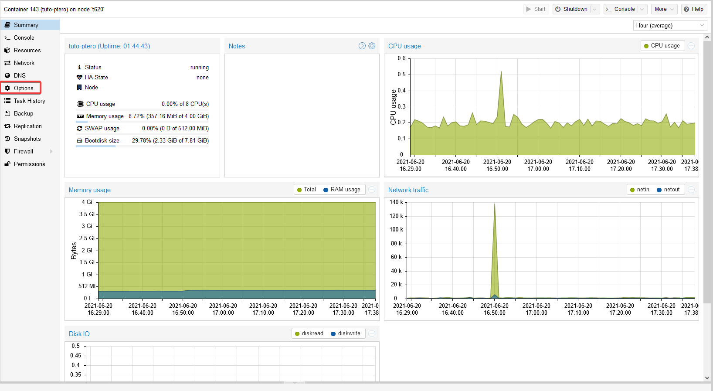
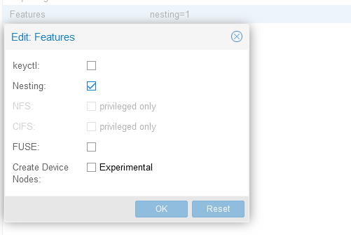
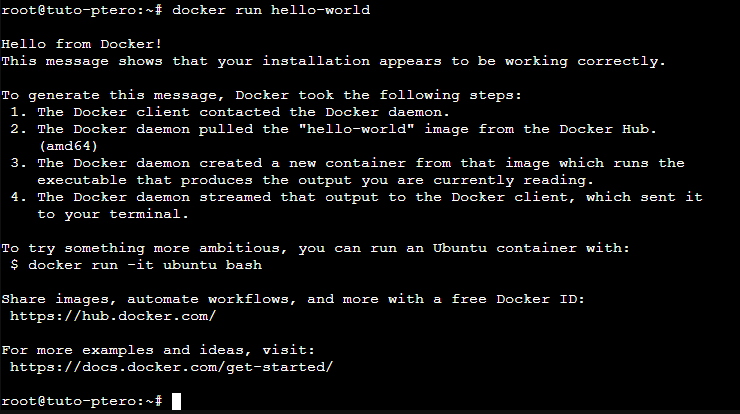

# Comment activer Docker sur un container LXC Proxmox ?

C'est plûtot simple, créez votre container LXC.

Puis rendez vous dans la catégorie "Options"

Dans la ligne Features, séléctionnez Nesting, puis vous pouvez redémarrer votre container.

Et voilà ! Docker est désormais activé dans votre CT LXC.

Vous pouvez vérifier ceci en runnant un hello-world :

docker run hello-world

