# Installer Pterodactyl (avec les IP Failover OVH)

C'est génial !
Cela fait bientôt plus d'1 an que j'essaie de faire marcher [Pterodactyl](https://pterodactyl.io) avec mes IP failover chez moi, et je restais bloqué à une bête erreur de Traffic.
Grâce à [@Aven](https://github.com/Aven678) et [@DrKnaw](https://github.com/DrKnaw) et leurs investigations, on a réussi à contourner ce blocage bête et à réussir à avoir une solution stable.

Ducoup aujourd'hui on se retrouve pour un petit tuto afin d'installer le panel Pterodactyl sur une VM (qui possède une IP failover si besoin) afin de pouvoir gérer facilement ses serveurs de jeu et héberger ses amis.

## 1 - Prérequis

* Un nom de domaine (de préférence passé sur Cloudflare car c'est cool)
* Ubuntu 20.04 (c'est mieux)

Connectez-vous à votre VPS en SSH, et on va le mettre à jour pour bien commencer :

```
apt update && apt full-upgrade -y
```

Ensuite on va appliquer notre petit "patch" réseau en modifiant notre fichier /etc/hosts

```
nano /etc/hosts
```


Et vous pouvez ensuite rajouter la ligne suivante :

```
127.0.0.1       panel.monpanel.fr
```

En n'oubliant pas de remplacer panel.monpanel.fr par le nom de domaine de notre panel.
Il sera également de créer une règle de en prenant pour exemple celle ci-dessous :


Une fois tout ceci effectué, on devrais avoir une base solide.

Je précise que ce tutoriel est **basé sur [la documentation officielle de Pterodactyl](https://pterodactyl.io/panel/1.0/getting_started.html)** qui est susceptible **d'être modifiée dans le futu**r. A l'heure où j'écris cette documentation, tout fonctionne, cependant, si dans le futur des dysfonctionnements apparaissent, j'essaierais de les corriger.

De plus, il est préférable que l'**IP failover soit déjà montée** pour que tout fonctionne dans le futur (voir l'ancienne doc : [ici](https://michelbaie.github.io/Tutos/OVH))

## 2 - Téléchargeons la base de notre Pterodactyl

On va déjà installer des dépendances de base en vrac :

```
apt install sudo bash curl wget gnupg software-properties-common apt-transport-https
```

A l'heure actuelle, la nouvelle version de PHP 8.0, mais vous pouvez encore être sur du PHP7, pour vérifier ceci on va voir les paquets PHP disponibles :

```
apt list | grep php
```

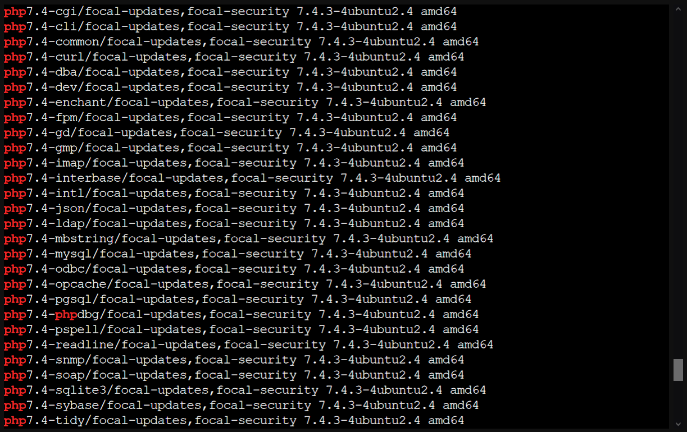

Si on remonte un peu, on peut voir que sur l'exemple ci-dessus, la version encore disponible est **PHP 7.4** on va devoir la **garder pour plus tard**

On peut ensuite installer les dépendances nécessaires à Pterodactyl :

```bash
apt -y install php php-{cli,gd,mysql,pdo,mbstring,tokenizer,bcmath,xml,fpm,curl,zip} mariadb-server nginx tar unzip git redis-server
```

Et supprimer apache2 (car il s'installe tout seul c'est chiant) :

```
apt-get purge apache* -y
```

Une fois que tout est propre sur notre machine, on peut continuer en installant composer (pour installer notre environnement php) :

```bash
curl -sS https://getcomposer.org/installer | sudo php -- --install-dir=/usr/local/bin --filename=composer
```

On peut ensuite créer nos fichiers :

```bash
mkdir -p /var/www/pterodactyl
cd /var/www/pterodactyl
```

Et on télécharge notre panel :

```bash
curl -Lo panel.tar.gz https://github.com/pterodactyl/panel/releases/latest/download/panel.tar.gz
tar -xzvf panel.tar.gz
chmod -R 755 storage/* bootstrap/cache/
```

## 3 - Créer la base de données MySQL (MariaDB)

A partir d'ici, nous allons avoir besoin d'une base de données MySQL pour le bon fonctionnement de notre Pterodactyl.
Par défaut, MariaDB (le serveur MySQL) est installé avec les dépendances qu'on à téléchargé au dessus, vous ne devriez donc pas avoir de problèmes de dépendances.

Connectez-vous à notre mysql :

```bash
mysql -u root
```

Puis créez un compte utilisateur :

```sql
USE mysql;
CREATE USER 'pterodactyl'@'127.0.0.1' IDENTIFIED BY 'somePassword';
```

N'oubliez pas de changer la valeur `somePassword` par un mot de passe très sécurisé (surtout que les IP OVH sont [victimes de beaucoup d'attaques](https://blog.ovh.com/fr/blog/rapport-attaques-ddos-observees-par-ovh-en-2017/))

On peut ensuite créer une base de données et donner les permissions à notre utilisateur :

```sql
CREATE DATABASE panel;
GRANT ALL PRIVILEGES ON panel.* TO 'pterodactyl'@'127.0.0.1' WITH GRANT OPTION;
```

Et appliquer toutes nos modifications :

```sql
FLUSH PRIVILEGES;
```

## 4 - Retournons à notre interface Web

Nous pouvons ensuite continuer notre installation en installant les dépendances composer :

```bash
cp .env.example .env
composer install --no-dev --optimize-autoloader
```

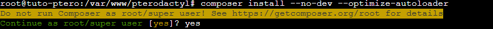

N'oubliez pas de dire **yes** pour faire tourner en tant que root, c'est déconseillé mais bon on va faire avec.

Et on génère les clés de notre interface :

```bash
php artisan key:generate --force
```

**Si jamais vous allez bouger votre serveur, gardez une copie de votre fichier .env (/var/www/pterodactyl/.env) car il contiens les clés de chiffrement de votre base de données. Sans celle-ci, toutes les données seront incompréhensible !**

## 5 - Les setups interactifs

On va commencer la petite partie interactive de ce tutoriel. Je vais mettre des captures d'écrans à chaque propositions.

Lançons le premier setup :

```bash
php artisan p:environment:setup
```

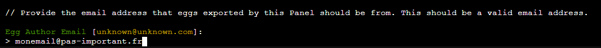

Ici, il nous demande un email qui sera affiché comme le créateur des eggs exporté depuis cette installation pterodactyl. Un egg est un petit script d'installation de serveur de jeu, si jamais vous en développez depuis votre instance, il est préférable de donner un email sympa. Sinon ce n'est pas important, vous ne recevrez jamais d'email avec cette option.

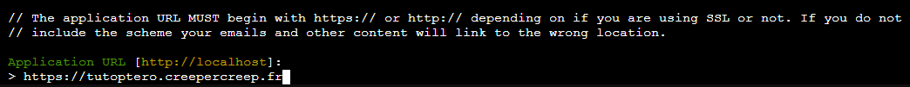

Ici, on lui donne notre URL que l'on utilisera dans notre navigateur web. Il est nécessaire de préciser le https:// comme indiqué dans l'image au dessus, car nous allons ensuite générer les certificats SSL. Il n'est pas non plus nécessaire de rajouter un / à la fin.

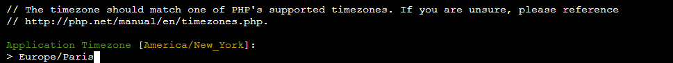

Ici, il nous demande le fuseau horaire PHP de notre installation. Si vous êtes en France, il faudra alors écrire `Europe/Paris`. Si vous êtes dans d'autres pays, vous pouvez consulter [la liste de PHP](https://www.php.net/manual/en/timezones.php).

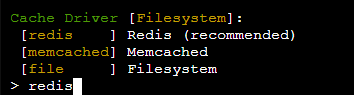

Ici, il nous demande quel type de serveur de cache on va utiliser pour notre Pterodactyl. Redis est parfait pour ce genre de situations, on va donc l'utiliser.


Ici, il nous demande quel type de manière nous allons utiliser pour se souvenir de nos sessions utilisateurs. Redis est également très bon pour faire ce genre d'actions, nous allons donc l'utiliser.

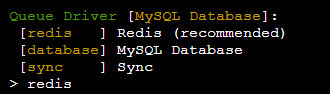

Ici, il nous demande le type de serveur qui va se souvenir des actions utilisateurs, nous allons également nous servir de redis.

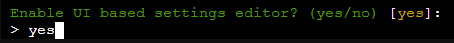

Ici, il nous demande si on souhaite modifier certaines options via l'interface web. On choisit la simplicité et disons yes.

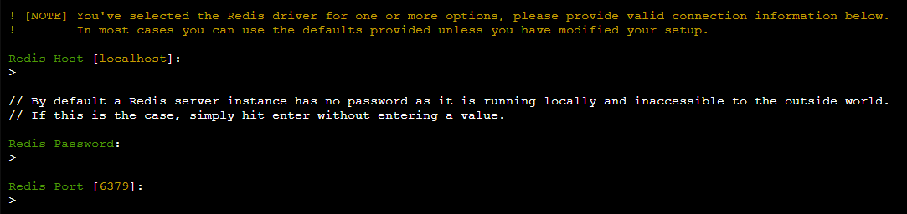

En ce qui en est des options pour redis, on laisse par défaut. Il n'y a pas de mot de passe, ce n'est qu'un serveur de cache local.

Nous en avons finit avec le premier setup interactif. Si aucune erreur en rouge n'est apparue, on va pouvoir continuer.
Il est maintenant temps de configurer la base de données que nous avons créé auparavant :

```bash
php artisan p:environment:database
```

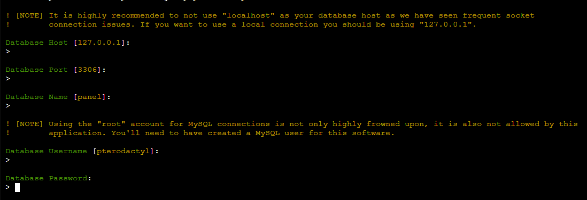

Si vous avez créé votre base de données avec les commandes que nous avions fait au dessus, vous pouvez laisser les valeurs pré-remplies en appuyant sur entrée et entrer le mot de passe lors du Database Password.

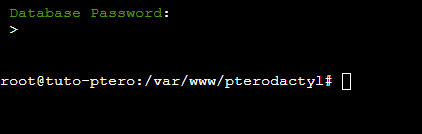

Vous n'êtes pas censé avoir obtenu d'erreurs. Si c'est le cas, vous pouvez retry en disant yes. Normalement vous vous êtes trompé de mot de passe, sinon votre installation d'ubuntu peut ne pas être propre et il peut rester des traces d'autres bases de données. Il serait donc préférable que vous recommenciez avec une installation propre ce tutoriel.

Nous n'allons pas configurer grand chose dans les mails :

```bash
php artisan p:environment:mail
```

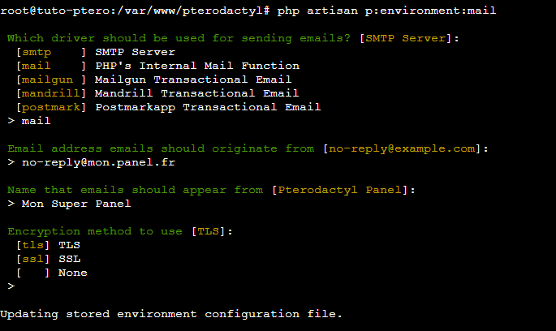

Ici, je n'ai pas de serveur SMTP et je ne me servirais jamais des mails, je sélectionne donc la fonction mail de PHP. Je ne suis pas sûr qu'elle fonctionne mais dans tous les cas je n'ai aucune utilité des mails donc ce n'est pas important. Cependant, si vous avez besoin des mails pour vos clients, il serait préférable que vous configuriez un serveur SMTP.

On peut maintenant initialiser notre base de données avec cette commande :

```bash
php artisan migrate --seed --force
```

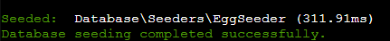

On va voir toutes les entrées se migrer dans la base de données et vous devriez avoir le message ci-dessus. Si ce n'est pas le cas, vous pouvez avoir mal configuré votre base données MySQL avec les commandes qu'on a fait au dessus. Je vous conseil de remonter et de les refaire.
Une fois que cette commande s'est bien passée, on va pouvoir continuer.

Créons notre premier utilisateur (Administrateur de préférence) :

```bash
php artisan p:user:make
```


