# Installer Pterodactyl (avec les IP Failover OVH)

C'est génial !
Cela fait bientôt plus d'1 an que j'essaie de faire marcher [Pterodactyl](https://pterodactyl.io) avec mes IP failover chez moi, et je restais bloqué à une bête erreur de Traffic.
Grâce à [@Aven](https://github.com/Aven678) et [@DrKnaw](https://github.com/DrKnaw) et leurs investigations, on a réussi à contourner ce blocage bête et à réussir à avoir une solution stable.

Ducoup aujourd'hui on se retrouve pour un petit tuto afin d'installer le panel Pterodactyl sur une VM (qui possède une IP failover si besoin) afin de pouvoir gérer facilement ses serveurs de jeu et héberger ses amis.

## 1 - Prérequis

* Un nom de domaine (de préférence passé sur Cloudflare car c'est cool)
* Ubuntu 20.04 (c'est mieux)
* Un VPS LXC (Avec Docker Activé) ou un VPS KVM

Connectez-vous à votre VPS en SSH, et on va le mettre à jour pour bien commencer :

```
apt update && apt full-upgrade -y
```

Ensuite on va appliquer notre petit "patch" réseau en modifiant notre fichier /etc/hosts

```
nano /etc/hosts
```


Et vous pouvez ensuite rajouter la ligne suivante :

```
127.0.0.1       panel.monpanel.fr
```

En n'oubliant pas de remplacer panel.monpanel.fr par le nom de domaine de notre panel.
Il sera également de créer une règle de en prenant pour exemple celle ci-dessous :


Une fois tout ceci effectué, on devrais avoir une base solide.

Je précise que ce tutoriel est **basé sur [la documentation officielle de Pterodactyl](https://pterodactyl.io/panel/1.0/getting_started.html)** qui est susceptible **d'être modifiée dans le futu**r. A l'heure où j'écris cette documentation, tout fonctionne, cependant, si dans le futur des dysfonctionnements apparaissent, j'essaierais de les corriger.

De plus, il est préférable que l'**IP failover soit déjà montée** pour que tout fonctionne dans le futur (voir l'ancienne doc : [ici](https://michelbaie.github.io/Tutos/OVH))

## 2 - Téléchargeons la base de notre Pterodactyl

On va déjà installer des dépendances de base en vrac :

```
apt install sudo bash curl wget gnupg software-properties-common apt-transport-https
```

A l'heure actuelle, la nouvelle version de PHP 8.0, mais vous pouvez encore être sur du PHP7, pour vérifier ceci on va voir les paquets PHP disponibles :

```
apt list | grep php
```


Si on remonte un peu, on peut voir que sur l'exemple ci-dessus, la version encore disponible est **PHP 7.4** on va devoir la **garder pour plus tard**

On peut ensuite installer les dépendances nécessaires à Pterodactyl :

```bash
apt -y install php php-{cli,gd,mysql,pdo,mbstring,tokenizer,bcmath,xml,fpm,curl,zip} mariadb-server nginx tar unzip git redis-server
```

Et supprimer apache2 (car il s'installe tout seul c'est chiant) :

```
apt-get purge apache* -y
```

Une fois que tout est propre sur notre machine, on peut continuer en installant composer (pour installer notre environnement php) :

```bash
curl -sS https://getcomposer.org/installer | sudo php -- --install-dir=/usr/local/bin --filename=composer
```

On peut ensuite créer nos fichiers :

```bash
mkdir -p /var/www/pterodactyl
cd /var/www/pterodactyl
```

Et on télécharge notre panel :

```bash
curl -Lo panel.tar.gz https://github.com/pterodactyl/panel/releases/latest/download/panel.tar.gz
tar -xzvf panel.tar.gz
chmod -R 755 storage/* bootstrap/cache/
```

## 3 - Créer la base de données MySQL (MariaDB)

A partir d'ici, nous allons avoir besoin d'une base de données MySQL pour le bon fonctionnement de notre Pterodactyl.
Par défaut, MariaDB (le serveur MySQL) est installé avec les dépendances qu'on à téléchargé au dessus, vous ne devriez donc pas avoir de problèmes de dépendances.

Connectez-vous à notre mysql :

```bash
mysql -u root
```

Puis créez un compte utilisateur :

```sql
USE mysql;
CREATE USER 'pterodactyl'@'127.0.0.1' IDENTIFIED BY 'somePassword';
```

N'oubliez pas de changer la valeur `somePassword` par un mot de passe très sécurisé (surtout que les IP OVH sont [victimes de beaucoup d'attaques](https://blog.ovh.com/fr/blog/rapport-attaques-ddos-observees-par-ovh-en-2017/))

On peut ensuite créer une base de données et donner les permissions à notre utilisateur :

```sql
CREATE DATABASE panel;
GRANT ALL PRIVILEGES ON panel.* TO 'pterodactyl'@'127.0.0.1' WITH GRANT OPTION;
```

Et appliquer toutes nos modifications :

```sql
FLUSH PRIVILEGES;
```

## 4 - Retournons à notre interface Web

Nous pouvons ensuite continuer notre installation en installant les dépendances composer :

```bash
cp .env.example .env
composer install --no-dev --optimize-autoloader
```


N'oubliez pas de dire **yes** pour faire tourner en tant que root, c'est déconseillé mais bon on va faire avec.

Et on génère les clés de notre interface :

```bash
php artisan key:generate --force
```

**Si jamais vous allez bouger votre serveur, gardez une copie de votre fichier .env (/var/www/pterodactyl/.env) car il contiens les clés de chiffrement de votre base de données. Sans celle-ci, toutes les données seront incompréhensible !**

## 5 - Les setups interactifs

On va commencer la petite partie interactive de ce tutoriel. Je vais mettre des captures d'écrans à chaque propositions.

Lançons le premier setup :

```bash
php artisan p:environment:setup
```


Ici, il nous demande un email qui sera affiché comme le créateur des eggs exporté depuis cette installation pterodactyl. Un egg est un petit script d'installation de serveur de jeu, si jamais vous en développez depuis votre instance, il est préférable de donner un email sympa. Sinon ce n'est pas important, vous ne recevrez jamais d'email avec cette option.


Ici, on lui donne notre URL que l'on utilisera dans notre navigateur web. Il est nécessaire de préciser le https:// comme indiqué dans l'image au dessus, car nous allons ensuite générer les certificats SSL. Il n'est pas non plus nécessaire de rajouter un / à la fin.


Ici, il nous demande le fuseau horaire PHP de notre installation. Si vous êtes en France, il faudra alors écrire `Europe/Paris`. Si vous êtes dans d'autres pays, vous pouvez consulter [la liste de PHP](https://www.php.net/manual/en/timezones.php).


Ici, il nous demande quel type de serveur de cache on va utiliser pour notre Pterodactyl. Redis est parfait pour ce genre de situations, on va donc l'utiliser.


Ici, il nous demande quel type de manière nous allons utiliser pour se souvenir de nos sessions utilisateurs. Redis est également très bon pour faire ce genre d'actions, nous allons donc l'utiliser.


Ici, il nous demande le type de serveur qui va se souvenir des actions utilisateurs, nous allons également nous servir de redis.


Ici, il nous demande si on souhaite modifier certaines options via l'interface web. On choisit la simplicité et disons yes.


En ce qui en est des options pour redis, on laisse par défaut. Il n'y a pas de mot de passe, ce n'est qu'un serveur de cache local.

Nous en avons finit avec le premier setup interactif. Si aucune erreur en rouge n'est apparue, on va pouvoir continuer.
Il est maintenant temps de configurer la base de données que nous avons créé auparavant :

```bash
php artisan p:environment:database
```


Si vous avez créé votre base de données avec les commandes que nous avions fait au dessus, vous pouvez laisser les valeurs pré-remplies en appuyant sur entrée et entrer le mot de passe lors du Database Password.


Vous n'êtes pas censé avoir obtenu d'erreurs. Si c'est le cas, vous pouvez retry en disant yes. Normalement vous vous êtes trompé de mot de passe, sinon votre installation d'ubuntu peut ne pas être propre et il peut rester des traces d'autres bases de données. Il serait donc préférable que vous recommenciez avec une installation propre ce tutoriel.

Nous n'allons pas configurer grand chose dans les mails :

```bash
php artisan p:environment:mail
```


Ici, je n'ai pas de serveur SMTP et je ne me servirais jamais des mails, je sélectionne donc la fonction mail de PHP. Je ne suis pas sûr qu'elle fonctionne mais dans tous les cas je n'ai aucune utilité des mails donc ce n'est pas important. Cependant, si vous avez besoin des mails pour vos clients, il serait préférable que vous configuriez un serveur SMTP.

On peut maintenant initialiser notre base de données avec cette commande :

```bash
php artisan migrate --seed --force
```


On va voir toutes les entrées se migrer dans la base de données et vous devriez avoir le message ci-dessus. Si ce n'est pas le cas, vous pouvez avoir mal configuré votre base données MySQL avec les commandes qu'on a fait au dessus. Je vous conseil de remonter et de les refaire.
Une fois que cette commande s'est bien passée, on va pouvoir continuer.

Créons notre premier utilisateur (Administrateur de préférence) :

```bash
php artisan p:user:make
```

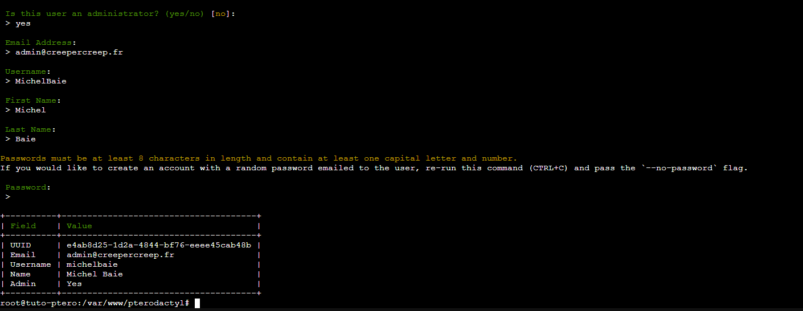

N'oubliez pas de préciser yes au tout début.

On peut enfin appliquer des permissions sur nos fichiers avec cette commande : 

```bash
chown -R www-data:www-data /var/www/pterodactyl/*
```

Pour terminer notre installation de l'interface web, il va falloir rajouter des lignes à notre crontab :

```
crontab -e
```

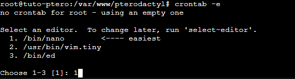

Je vous conseille fortement de choisir 1 pour ouvrir nano.

Et vous pouvez ensuite tout en bas rajouter la ligne suivante au fichier :

```bash
* * * * * php /var/www/pterodactyl/artisan schedule:run >> /dev/null 2>&1
```

Comme ci-dessous :

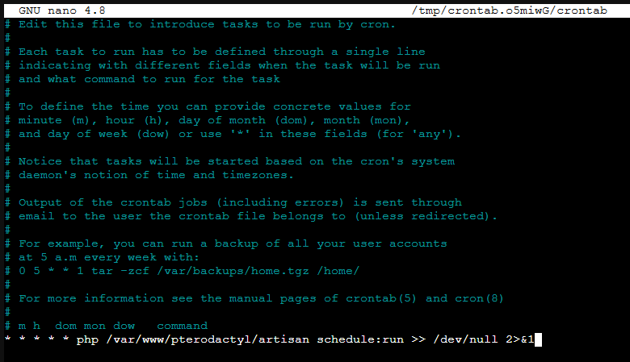

On peut ensuite quitter le fichier avec Contrôle X Y puis Entrée, ou autre si vous avez votre linux en Français (suivez les indications en bas de la fenêtre nano).

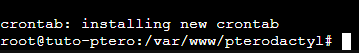

Notre crontab est maintenant installée.

Mais ce n'est pas tout, il va également falloir créer un service systemd avec les commandes suivantes :

```
nano /etc/systemd/system/pteroq.service
```

Vous pouvez ensuite rajouter le bloc de texte suivant à l'intérieur puis quitter nano :

```text
# Pterodactyl Queue Worker File
# ----------------------------------

[Unit]
Description=Pterodactyl Queue Worker
After=redis-server.service

[Service]
# On some systems the user and group might be different.
# Some systems use `apache` or `nginx` as the user and group.
User=www-data
Group=www-data
Restart=always
ExecStart=/usr/bin/php /var/www/pterodactyl/artisan queue:work --queue=high,standard,low --sleep=3 --tries=3

[Install]
WantedBy=multi-user.target
```

Enfin, on peut activer tous les services dont pterodactyl à besoin pour fonctionner avec les commandes suivantes :

```bash
sudo systemctl daemon-reload
sudo systemctl enable --now redis-server pteroq.service
```

## 6 - Notre Serveur Web (NGINX)

Maintenant que tout est prêt du côté de nos fichiers, il va falloir préparer notre serveur qui va nous les offrir.

Il est nécessaire à cette étape, que vos règles DNS soient réalisées et propagées. Vous pouvez vérifier la propagation DNS [ici](https://dnschecker.org/).

Nous allons demander un certificat SSL Let's Encrypt qui est gratuit avec les commandes qui suivent.

Installons tout d'abord Let's Encrypt :

```bash
sudo apt install -y certbot python3-certbot-nginx
```

Une fois ceci fait on va pouvoir demander nos certificats auprès de let's encrypt avec les commandes suivantes :

```bash
certbot certonly --nginx -d monpanel.monpanel.fr
```

Remplacez le nom de domaine par le votre sans les https.

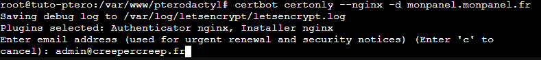

Ici, il nous demande notre adresse email sur laquelle on va recevoir les avertissements pour le renouvellement des certificats. C'est un peu important donc essayez de mettre un vrai email.

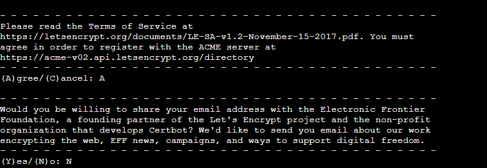

Ici, il nous demande si on accepte les TOS, on dit A pour accepter et ensuite il nous demande si on souhaite être abonné à une newsletter pour des projets libres en rapport avec internet, ce n'est pas obligatoire on refuse avec N.


Si vous avez un résultat similaire au mien, c'est parfait ! Notre certificat est bien installé sur notre machine on va pouvoir s'en servir.
Si vous obtenez une erreur "Challenge Failed", vérifiez vos enregistrements DNS et recommencez la commande au dessus.

Pour avoir un renouvellement automatique dans le futur, on peut ajouter à notre crontab la commande suivante :

```
crontab -e
```

Puis rajoutez dedans :

```bash
certbot renew
```

On sauvegarde et tout est prêt pour nos certificat SSL.

Il est maintenant temps d'installer notre configuration NGINX pour faire marcher notre Pterodactyl.

Pour ce faire, il va falloir créer un fichier de configuration nginx avec la commande suivante :

```
nano /etc/nginx/sites-available/pterodactyl.conf
```

Et vous pouvez copier coller en brut le texte suivant, on va le modifier au fur et à mesure :

```text
server_tokens off;

server {
    listen 80;
    server_name <domain>;
    return 301 https://$server_name$request_uri;
}

server {
    listen 443 ssl http2;
    server_name <domain>;

    root /var/www/pterodactyl/public;
    index index.php;

    access_log /var/log/nginx/pterodactyl.app-access.log;
    error_log  /var/log/nginx/pterodactyl.app-error.log error;

    # allow larger file uploads and longer script runtimes
    client_max_body_size 100m;
    client_body_timeout 120s;

    sendfile off;

    # SSL Configuration
    ssl_certificate /etc/letsencrypt/live/<domain>/fullchain.pem;
    ssl_certificate_key /etc/letsencrypt/live/<domain>/privkey.pem;
    ssl_session_cache shared:SSL:10m;
    ssl_protocols TLSv1.2 TLSv1.3;
    ssl_ciphers "ECDHE-ECDSA-AES128-GCM-SHA256:ECDHE-RSA-AES128-GCM-SHA256:ECDHE-ECDSA-AES256-GCM-SHA384:ECDHE-RSA-AES256-GCM-SHA384:ECDHE-ECDSA-CHACHA20-POLY1305:ECDHE-RSA-CHACHA20-POLY1305:DHE-RSA-AES128-GCM-SHA256:DHE-RSA-AES256-GCM-SHA384";
    ssl_prefer_server_ciphers on;

    # See https://hstspreload.org/ before uncommenting the line below.
    # add_header Strict-Transport-Security "max-age=15768000; preload;";
    add_header X-Content-Type-Options nosniff;
    add_header X-XSS-Protection "1; mode=block";
    add_header X-Robots-Tag none;
    add_header Content-Security-Policy "frame-ancestors 'self'";
    add_header X-Frame-Options DENY;
    add_header Referrer-Policy same-origin;

    location / {
        try_files $uri $uri/ /index.php?$query_string;
    }

    location ~ \.php$ {
        fastcgi_split_path_info ^(.+\.php)(/.+)$;
        fastcgi_pass unix:/run/php/php8.0-fpm.sock;
        fastcgi_index index.php;
        include fastcgi_params;
        fastcgi_param PHP_VALUE "upload_max_filesize = 100M \n post_max_size=100M";
        fastcgi_param SCRIPT_FILENAME $document_root$fastcgi_script_name;
        fastcgi_param HTTP_PROXY "";
        fastcgi_intercept_errors off;
        fastcgi_buffer_size 16k;
        fastcgi_buffers 4 16k;
        fastcgi_connect_timeout 300;
        fastcgi_send_timeout 300;
        fastcgi_read_timeout 300;
        include /etc/nginx/fastcgi_params;
    }

    location ~ /\.ht {
        deny all;
    }
}
```

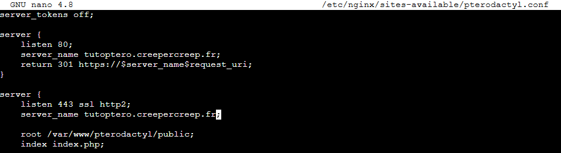

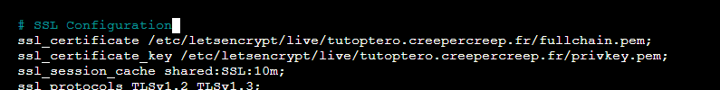

Il faut remplacer "domain" par votre nom de domaine associé au panel.

Ensuite, il va falloir remplacer la version de PHP inclue par défaut, par celle que nous avons installé au dessus. Pour ma part (voir l'exemple tout en haut), c'étais la version 7.4. Je remplace donc mon PHP 8.0 par 7.4 dans la conf comme ci-dessous :

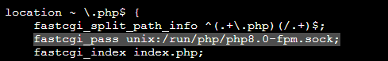

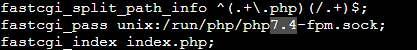

On peut ensuite sauvegarder le fichier, et activer ce fichier avec la commande suivante :

```bash
sudo ln -s /etc/nginx/sites-available/pterodactyl.conf /etc/nginx/sites-enabled/pterodactyl.conf
```

Une petite verification avec :

```
nginx -t
```

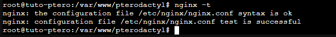

Si tout est ok on peut redémarrer nginx et notre interface web devrait être accessible !

```
systemctl restart nginx
```

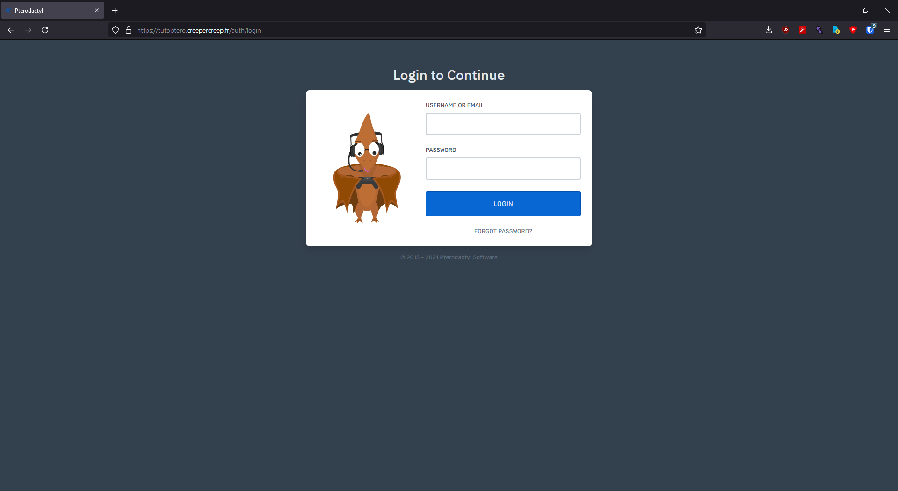

Cependant, **ce n'est pas finit** ! Il va maintenant falloir configurer wings ...

## 7 - Visite de l'interface

Une fois que vous êtes connectés avec vos identifiants, on va pouvoir faire un petit tour du propriétaire.

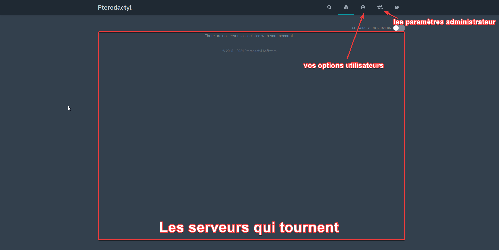

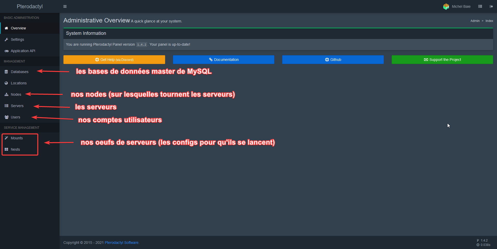

Bref c'étais une petite visite courte, on va maintenant pouvoir faire marcher cette interface avec wings.

## 8 - Le daemon (Wings)

Wings, c'est le daemon qui va créer, gérer, supprimer, les serveurs. Sans lui on n'aurais aucun contrôle et possibilité de création de serveurs sur pterodactyl. Il est donc très important de l'installer sinon vous ne pourrez rien faire ...

Pour l'installer nous allons d'abord avoir besoin de Docker (vu que ce sont des containers bien isolés) :

```bash
curl -sSL https://get.docker.com/ | CHANNEL=stable bash
```

Une fois cette commande fait, vous devez attendre un peu le temps qu'il installe tout et vous devriez finir par avoir un écran comme celui-ci qui vous donne toutes les spécifications techniques de votre serveur :

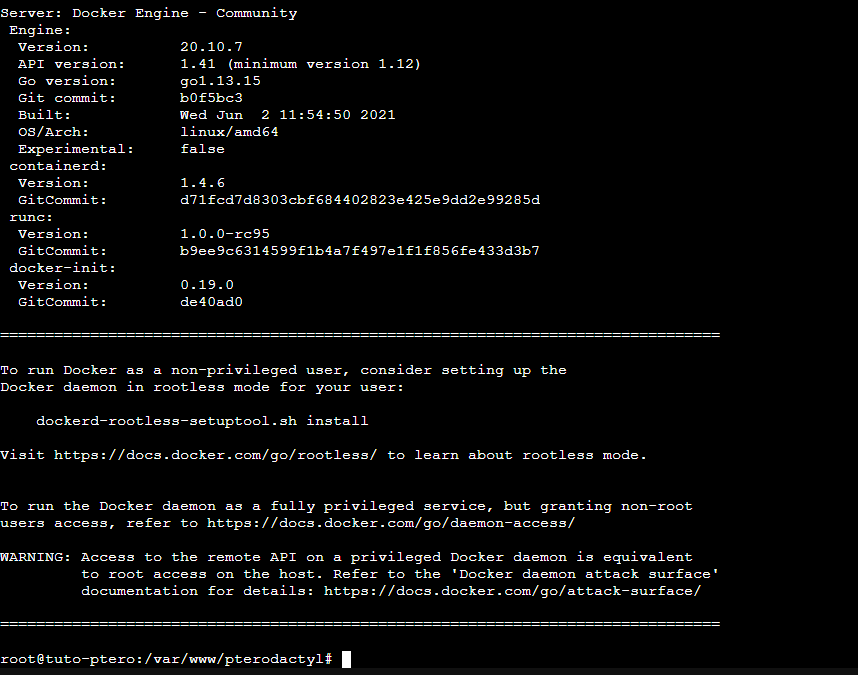

Cela signifie que Docker est bien installé et prêt à fonctionner. 

Pour vérifier qu'il fonctionne bien on peut lancer un hello-world :

```
docker run hello-world
```

Ici, mon VPS n'avais pas le LXC donc j'obtenais une erreur : 

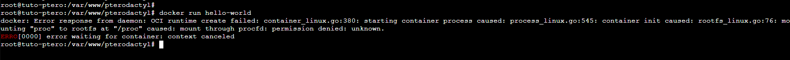

Si vous avez une erreur similaire, docker n'est pas activé ou n'est pas compatible ! Contactez votre hébergeur pour qu'il vous l'active :(

Si docker est activé vous devriez avoir ceci :


Si c'est le cas, parfait ! On va pouvoir continuer.

On peut maintenant activer docker au démarrage :

```bash
systemctl enable --now docker
```

**Si vous êtes sous KVM**, vous pouvez activer le swap dans Grub en modifiant le fichier suivant : 

```
nano /etc/default/grub
```

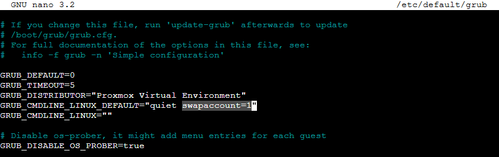

Vous pouvez rajouter `swapaccount=1` à côté du quiet, puis sauvegarder. Et n'oubliez pas de sauvegarder avec `update-grub` et un petit redémarrage `reboot`.

Commençons maintenant à installer wings avec les commandes suivantes :

```bash
mkdir -p /etc/pterodactyl
curl -L -o /usr/local/bin/wings https://github.com/pterodactyl/wings/releases/latest/download/wings_linux_amd64
chmod u+x /usr/local/bin/wings
```

On peut ensuite créer un service wings avec :

```
nano /etc/systemd/system/wings.service
```

Et vous pouvez coller dedans :

```text
[Unit]
Description=Pterodactyl Wings Daemon
After=docker.service
Requires=docker.service
PartOf=docker.service

[Service]
User=root
WorkingDirectory=/etc/pterodactyl
LimitNOFILE=4096
PIDFile=/var/run/wings/daemon.pid
ExecStart=/usr/local/bin/wings
Restart=on-failure
StartLimitInterval=600

[Install]
WantedBy=multi-user.target
```

Maintenant que notre wings est prêt à fonctionner, on va devoir l'ajouter dans notre interface web. Retournons dans notre navigateur web.

Ajoutons d'abord un location en allant dans l'onglet "Locations" de notre panel administrateur :

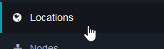

Et ajoutons en cliquant sur 'Create New' une location, les valeurs entrées ne sont pas importantes.

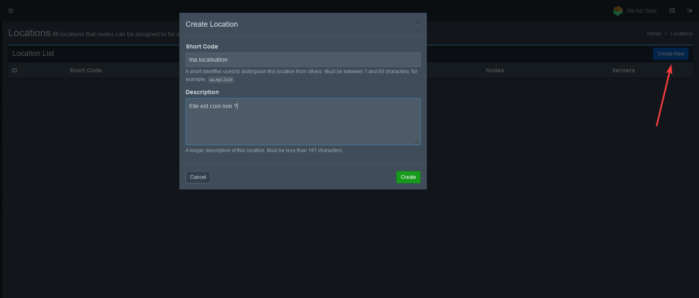

Une fois ceci fait, on va pouvoir créer une nouvelle node, en nous rendant dans l'onget "Nodes", puis "Create New"

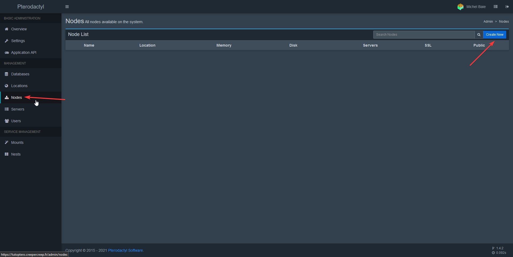

Vous pouvez ensuite remplir comme les champs comme ci-dessous :

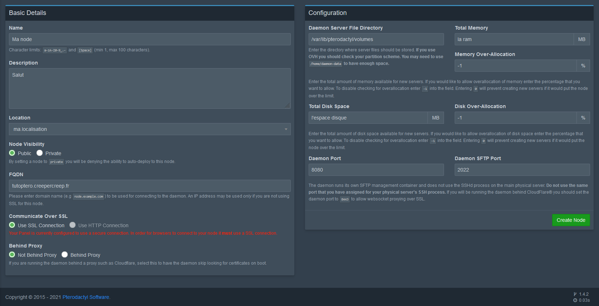

Le FQDN doit être identique au nom de domaine du panel (sans https)
Total Memory et Total Disk Space doit être exprimé en MB
Memory & Disk Over-Allocation : -1 permet d'éviter d'être bloqué pour des limites de stockages, cependant si vous avez un espace de stockage plûtot limité, essayez de mettre 0.

Une fois tout rempli, vous pouvez cliquer sur "Create Node".

On va maintenant pouvoir configurer nos allocations :

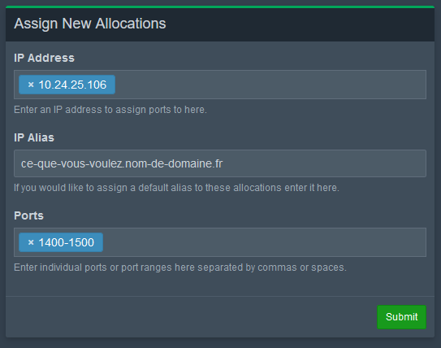

Si vous avez des IP Failover comme chez moi, IP Address doit être définit sur l'ip Lan WireGuard.
Si vous avez un VPS normal, rentrez l'ip publique ou privée de votre VPS.

Ip Alias est le nom de domaine qui sera affiché publiquement dans le panel, vous pouvez définir une autre règle DNS si vous le souhaitez.

Les ports eux peuvent être définis sous forme de range de 100 comme moi ci-dessus (J'alloue tous les ports en 1400 et 1500) ou bien individuellement en les rentrant 1 par 1.

On peut ensuite cliquer sur Submit.

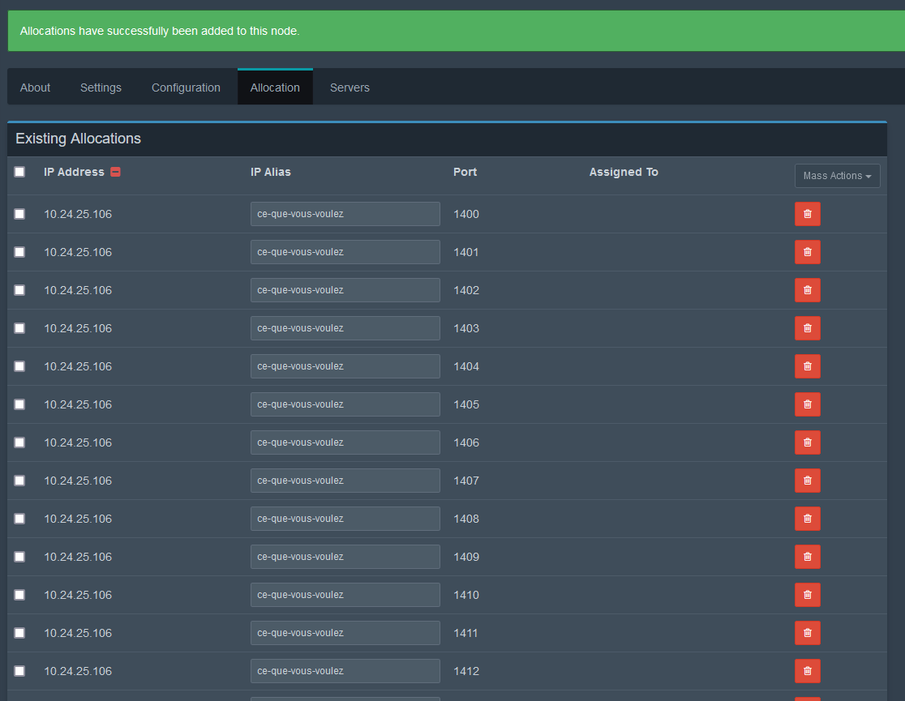

On les vois ensuite apparaître.

On peut maintenant charger notre configuration dans l'onglet configuration.


Vous pouvez copier tout le fichier de configuration en sélectionnant tout. Puis le coller dans fichier config.yml :

```
mkdir /etc/pterodactyl
nano /etc/pterodactyl/config.yml
```

Et vous pouvez tout coller à l'intérieur puis sauvegarder.

Une fois ceci fait, on va pouvoir activer notre Wings et le lancer :

```bash
systemctl daemon-reload
systemctl enable wings --now
```

On peut voir l'état de notre service avec :

```
systemctl status wings
```

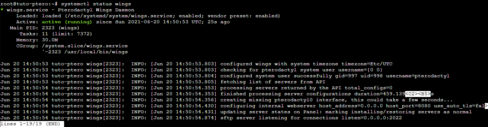

Si tout est vert c'est parfait ! De plus il doit être noté tout en bas "sftp server listening for connections ..."

On peut maintenant retourner sur notre interface web et on devrais avoir un peu plus d'info dans About :

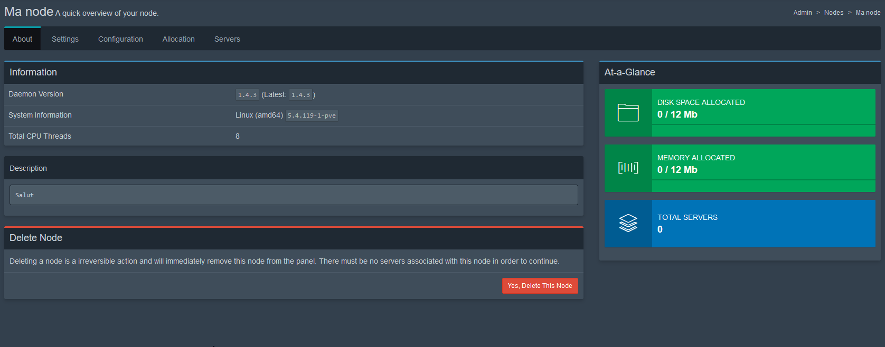

Et si tout est ok vous devriez avoir un petit cœur vert dans l'onglet nodes :

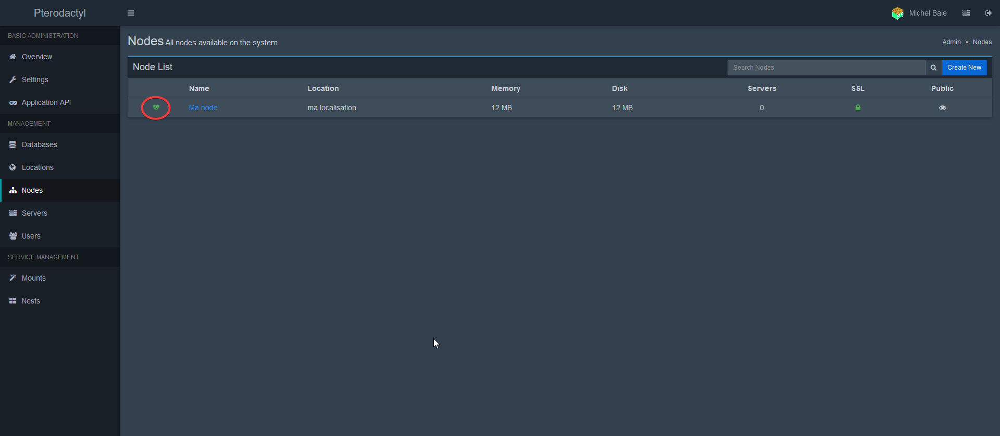

Et voilà ! Notre pterodactyl est maintenant installé et prêt à fonctionner :)

## 9 - Quelques exemples de comment l'utiliser

Je publierais une vidéo ce sera beaucoup plus rapide et simple à expliquer qu'à écrire.

## 10 - PHPMyAdmin

On va voir plus tard comment installer PHPMyAdmin

## 11 - Et voici

Et voilà !
On a fini de tuto pour installer pterodactyl. Amusez-vous bien :)
