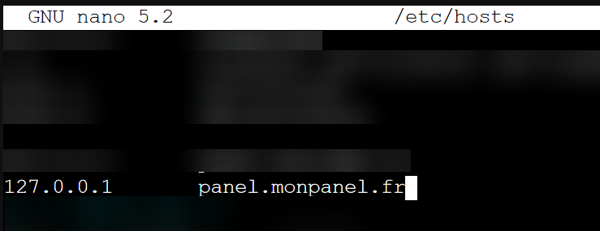
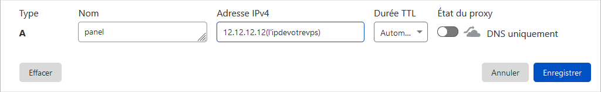

# Installer Pterodactyl avec les IP Failover OVH

C'est génial !
Cela fait bientôt plus d'1 an que j'essaie de faire marcher [Pterodactyl](https://pterodactyl.io) avec mes IP failover chez moi, et je restais bloqué à une bête erreur de Traffic.
Grâce à [@Aven](https://github.com/Aven678) et [@DrKnaw](https://github.com/DrKnaw) et leurs investigations, on a réussi à contourner ce blocage bête et à réussir à avoir une solution stable.

Ducoup aujourd'hui on se retrouve pour un petit tuto afin d'installer le panel Pterodactyl sur une VM (qui possède une IP failover si besoin) afin de pouvoir gérer facilement ses serveurs de jeu et héberger ses amis.

## 1 - Prérequis

* Un nom de domaine (de préférence passé sur CloudFlare car c'est cool)
* Ubuntu 20.04 (c'est mieux)

Connectez-vous à votre VPS en SSH, et on va le mettre à jour pour bien commencer :

```
apt update && apt full-upgrade -y
```

Ensuite on va appliquer notre petit "patch" réseau en modifiant notre fichier /etc/hosts

```
nano /etc/hosts
```



Et vous pouvez ensuite rajouter la ligne suivante :

```
127.0.0.1       panel.monpanel.fr
```

En n'oubliant pas de remplacer panel.monpanel.fr par le nom de domaine de notre panel.
Il sera également de créer une règle de en prenant pour exemple celle ci-dessous :




Une fois tout ceci effectué, on devrais avoir une base solide.
Ce tutoriel va suivre la documentation officielle de pterodactyl, elle est suceptible d'être modifiée avec le temps et ce tuto peut ne plus très bien fonctionner. Cependant, j'essaierai de le mettre à jour afin qu'il fonctionne sur le long terme.

